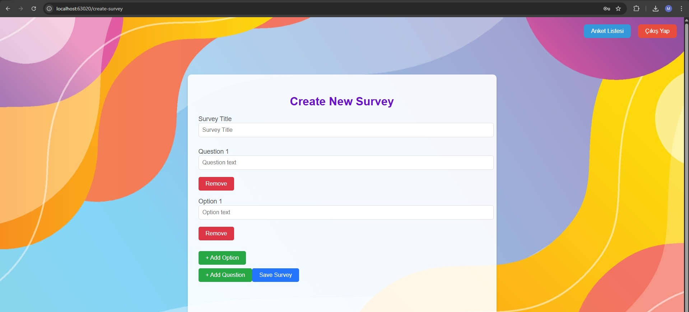
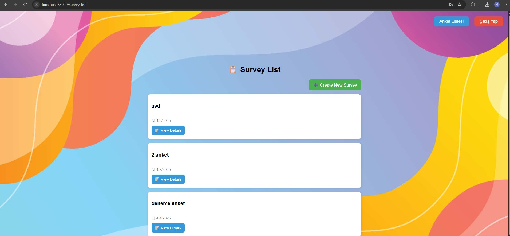

# Ankett Uygulaması

**Ankett**, kullanıcıların kendi anketlerini oluşturabileceği, paylaşabileceği ve yanıtları analiz edebileceği dinamik bir web uygulamasıdır. Vue.js ön yüz, ASP.NET Core arka uç ile geliştirilmiştir.

---

## 🚀 Özellikler

- Anket oluşturma, düzenleme ve silme
- Kullanıcıların anonim veya kayıtlı kullanıcı olarak katılımı
- Yanıtların grafiklerle görsel analizi
- reCAPTCHA desteği ile bot koruması
- Responsive tasarım

---

## 📸 Ekran Görüntüleri

### Anket Oluşturma

### Anket Listesi

### Anket Sonuçları

